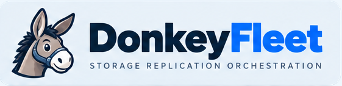

<picture>
  <source media="(prefers-color-scheme: dark)" srcset="assets/branding/banner-dark.png">
  <source media="(prefers-color-scheme: light)" srcset="assets/branding/banner-bright.png">
  
</picture>

# DonkeyFleet deployment assets

DonkeyFleet is a focused, volume-level controller for managing NetApp SnapMirror replication
between on-premises ONTAP and Amazon FSx for NetApp ONTAP. It continuously compares declared
policy with observed storage state, presents proposed changes for human approval, and performs
only explicitly permitted destination-side actions.

This repository contains deployment assets only. It does not contain the DonkeyFleet application
source code.

## Choose a deployment

| Deployment | Best for | Included services |
|---|---|---|
| [Helm](helm/donkeyfleet-chart/README.md) | Kubernetes and production deployments | DonkeyFleet, with optional bundled PostgreSQL |
| [Standalone](deploy/standalone/README.md) | Evaluation, demos, and small installations | DonkeyFleet, PostgreSQL, Vault, and Keycloak through Docker Compose |

For production, prefer the Helm chart with external PostgreSQL, Vault, and OIDC services. The
standalone stack deliberately uses development-mode Vault and Keycloak and is intended for one
small deployment rather than a highly available control plane.

## Helm quick start

The public OCI chart is available from Docker Hub:

```bash
helm show chart oci://registry-1.docker.io/saragihruben29/donkeyfleet-chart --version 1.0.1
```

Create a values file with your image, OIDC, Vault, database, and Secret settings, then install:

```bash
helm install donkeyfleet \
  oci://registry-1.docker.io/saragihruben29/donkeyfleet-chart \
  --version 1.0.1 \
  --namespace donkeyfleet \
  --create-namespace \
  --values my-values.yaml
```

The chart artifact and the application image are independent. Set `image.repository` and
`image.tag` to an image your cluster can pull, and configure `imagePullSecrets` when it is private.

## Standalone quick start

From `deploy/standalone`, copy the example configuration and set `DONKEYFLEET_IMAGE` to an image
you can pull:

```bash
cp .env.example .env
docker compose -f docker-compose.yml up -d
```

Open `http://host.docker.internal:8090`. See the standalone README for Linux host-name setup,
default local users, Vault credential seeding, persistence, upgrades, and teardown.

## Safety model

- Source-role clusters are read-only.
- Volume identity uses ONTAP volume UUIDs, not names.
- Apply starts in dry-run unless explicitly enabled.
- Approved intent is persisted in PostgreSQL before the first ONTAP write.
- ONTAP asynchronous jobs are checkpointed and never blindly reissued.
- Initializations are serialized by the automation profile's concurrency and bandwidth limits.
- Deletion always requires human confirmation.
- Multiple application replicas share one PostgreSQL-backed advisory lock, keeping reconciliation
  single-writer; ingress sticky sessions are not required when every pod uses the same OIDC cookie
  encryption key.

## Public repository hygiene

Examples use placeholder endpoints and secret names. Do not commit `.env`, Kubernetes Secrets,
private registry credentials, Vault tokens, cluster endpoints, or FSx identifiers. Use
`.env.example`, Kubernetes Secrets, and your platform's secret-management integration instead.


Please visit https://donkeyfleet.com for detailed donkeymentation.

